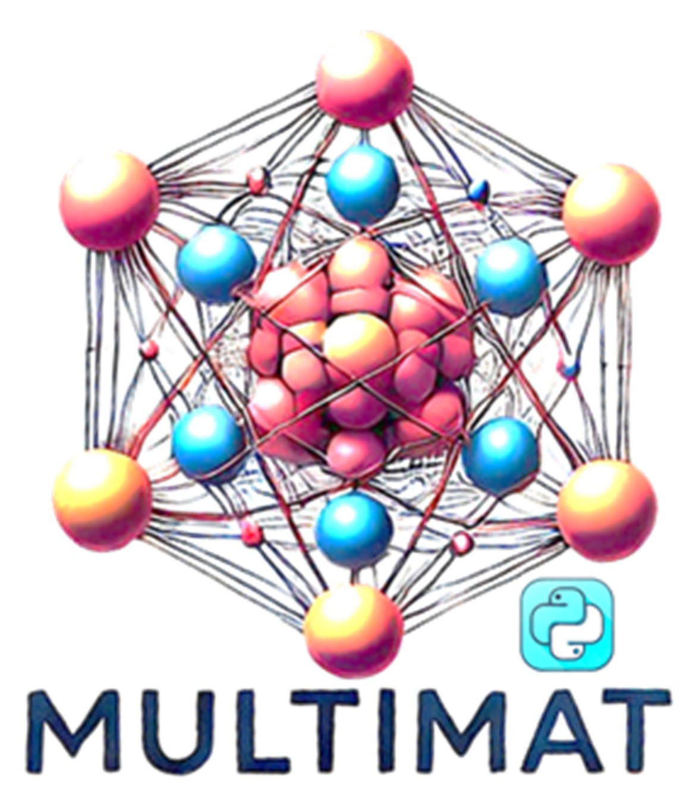

# Welcome to Multimat code 

# 

A python code to perform pre-and-post treatment of computational data from ab-initio simulation packages.

## Brief introduction
This code is purely written in python, with assistances of the following packages:

1. ASE
   ##### Utility: to parse some structure files and perform transformation
   ##### https://wiki.fysik.dtu.dk/ase/
   #####
   
2. pymatgen
   ##### Utility: to parse some structure files and perform transformation
   ##### https://pymatgen.org/
   #####
   
4. phonopy
   ##### Utility: to support calculation of phono properties
   ##### https://phonopy.github.io/phonopy/
   #####

   ...to be further added
   
## Description
Currently, the developer mainly provides the .exe code that can run directly in windows system, which is created by pyinstaller. Perhaps, the Linux version will also be released according to feedbacks. 

The developer will gradually provide the guidance about how to use Multimat. But to mind that, one can also follow the reminding information that printed onto the screen when running .exe code.

Beginning time of development: 5/6/2024.

Free of charge to use, with partial release of original code. And, Multimat welcomes all the developers, because the developer is very busy (Now only two members). The paper for Multimat is still a long time to go, perhaps.

###
## Developer list
Dr. Xuan Wang (xwgarrett@gmail.com) 

If you have questions and suggestions, please do not hesitate to communicate with the developer. 

####
Affiliations:
Nanjing Normal University, School of Chemistry and Materials Science, Nanjing, China

###
## Components
### main_plate.py
The earliest function of Multimat. The developer defines this .py to connect the other components in Multimat.

As the name states, the main_plate.py is the main page of Multimat, which contains the basic functions of:

- calculate the band center for vasp, and for other functions via vasp, if really necessary, will be developed because there already exists vaspkit (https://vaspkit.com/)
- povray rendering via ase (You need to setting the code of povray and place it within environment condition)
- check cell information of structure file, including lattice matrix, symmetry, and will output the primitive structure in .cif
- make supercell
- generate displaced structure by ptmatgen or phonopy, to calculate phonon properties
- structure file transformation, mainly via ase
- create small mocules in .cif, a simple function
- transform .cube into .xsf because .cube file cannot support the periodic view of structure (This function is the correction of ase bug of .xsf, and creates the same result as c2x code)
- create the cp2k .inp file (cp2k_inp_kit.py), a large part of function in Multimat, keep developing
- cp2k post-treatment functions (cp2k_post_treatment.py), a large part of function in Multimat, keep developing
- quantum espresso functions are now almost blank to be developed, or if others will come to promote the development, so in (dev) and the developer do not package
- surface pourbaix part, a large part of catalysis function, keep developing

####
### CP2K_inp_kit.py
A large function in Multimat to create the .inp file for CP2K (https://www.cp2k.org/). 

Now support the parsing of structure file including .cif, POSCAR, CONTCAR, .inp, .restart

You can create the calculation types of GEO_OPT, CELL_OPT, ENERGY, ENERGY_FORCE, VIBRATIONAL_ANALYSIS, AIMD, Transition_state by DIMER, Transition_state by CI-NEB, phonon calculation with finite displacement, global optimization by minima_hopping

Other functions are provided in the function index 30, briefly speaking: 
- change between OT and DIAG algorithm
- change XC_FUNCTION
- perform BSSE
- use LS_SCF method
- use SMEARING
- DFT + U
- change PSOLVER
- perform MAGNETIZATION with BS
- perform DIPOLE CORRECTION
- ATOM constraint
- use SCCS implicit solvents
- ...

So you just need to copy the other functions output into the main functions output, then you construct the whole .inp file that can be used. 

####
### CP2K_post_treatment.py
A large function in Multimat to perform post-treatments for CP2K (https://www.cp2k.org/). 

Multimat provides the interaction with Multiwfn code developed by Dr. Tian Lu, so if you use the relevant functions of Multiwfn, please make sure the citation.

Download the Multiwfn code: http://sobereva.com/multiwfn/

The most common functions have been packaged into Multimat, including:

- replace the opted structure into the initial .inp file for continuing calculation
- add the cell and charge information into molden, to corroborate with Multiwfn code
- view crystal orbital orbitals via molden with Multiwfn
- get the .cube files from crystal orbitals via Multiwfn
- calculate the Fermi level from molden
- transform the .restart file into .cif
- perform DOS and PDOS smearing via Gaussian, Lorentzian, Voigt functions
- calculate the band center from PDOS
- plot bandstructure
- thermodynamic calculation for adsorbates and molecules
- perform phonon band structure, and DOS
- AIM charge by Bader
- smear IR and Raman spectra
- obtain vibration IR spectra from AIMD
- reduce supercell into unit cell according to symmetry
- calculate charge density difference
- transform Hartree potential into electrostatic potential
- calculate workfunction via average potential along Z direction
- create NEB points (two methods according to different needs)
- calculate eigenvalyes of EPS hyperfine with matrix
- ...

(to be further developed)

####
### surface_pourbaix.py
A large function in Multimat to perform surface Pourbaix diagram construction.

Now supports the calculation surface Pourbaix diagram as the function between delta_G and U_RHE (and U_SHE)

Type of adsorbates: *OH, *O, *H2O, *H, and anion vacancy.

This code is under instant development. More methods will be provided in the next released versions of Multimat. 

Each component part of Multimat is relatively independent, to make the debug process easy. They are written in the big function format to be imported into the main_plate.py.

####
### setting.params
The setting.params file presents the external definitions. This file should be put at the same directory of Multimat.exe

####
## History
2024.5.6: the creation of main_plate.py

2024.8.10: the creation of CP2K_inp_kit.py

2024.9.10: the creation of CP2K_post_treatment.py

2024.11.1: the creation of catkit.py, only supports the oxygen intermediates

2025.1.10: the adding ot AIM charge by Bader into CP2K_post_treatment.py

2025.2.8: the appearance of Multimat into github

2025.2.18: Fix the bug of package for Bader's AIM

2025.4.20: Remove pybader owing to the bug in package

2025.5.2: replace the catkit.py with surface_pourbaix module

2025.5.15: add the calculation with efield parameters in surface_pourbaix module

2025.5.20: the continuous development of module for qe

2025.6.5: add some simple functions for vasp with convenience in main_plate.py
...

    